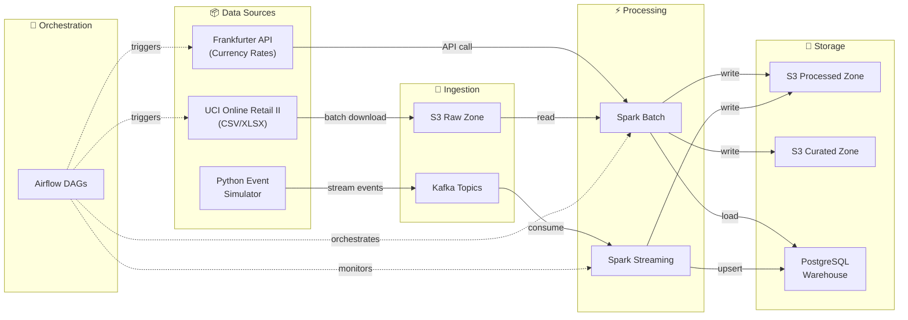
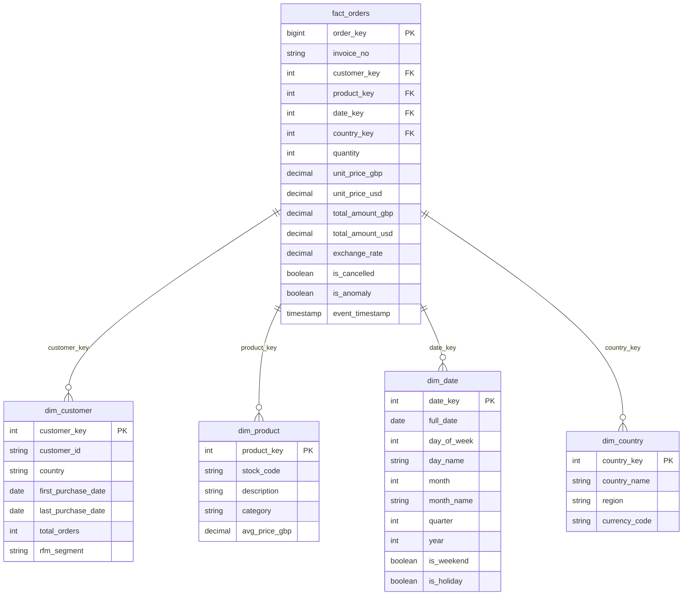
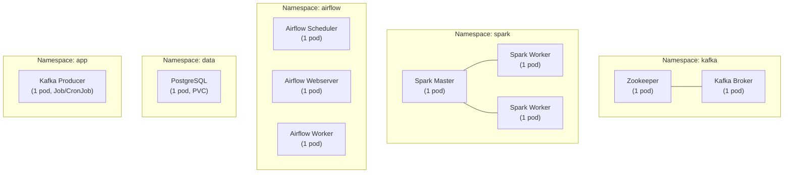

# 🚀 Real-Time E-Commerce Analytics Pipeline

> An end-to-end data engineering project combining **Docker, Kubernetes, AWS (free tier), Kafka, Spark, Airflow, Python, SQL, and ETL/ELT** into a single, cohesive platform.

---

## Project Concept

Build a **real-time and batch analytics pipeline** for e-commerce transaction data. The system ingests historical order data in batch, replays it as a real-time event stream, enriches it with live currency conversion rates, and produces a dimensional data warehouse for business analytics.

**Why this project?**
- Naturally requires both **streaming** (real-time orders) and **batch** (historical backfill, daily aggregations) — exercising the full ETL/ELT spectrum
- Multiple data sources force real **data integration** challenges (schema mapping, currency conversion, deduplication)
- Complex enough to justify Kafka, Spark, and Airflow — but small enough to run on a laptop + AWS free tier
- Portfolio-worthy: fraud flagging, revenue dashboards, customer segmentation

---

## Data Sources

### 1. Primary — UCI Online Retail II Dataset (Batch)

| Detail | Value |
|---|---|
| **URL** | https://archive.ics.uci.edu/dataset/502/online+retail+ii |
| **Format** | `.xlsx` (convert to CSV/Parquet on ingestion) |
| **Records** | ~1,067,371 transactions |
| **Timeframe** | Dec 2009 – Dec 2011 |
| **License** | CC BY 4.0 (free, no auth required) |
| **Key Columns** | `Invoice`, `StockCode`, `Description`, `Quantity`, `InvoiceDate`, `Price`, `Customer ID`, `Country` |

> [!TIP]
> This dataset is from a UK-based wholesaler selling to 43 countries. Prices are in **GBP**, which creates a natural need for currency enrichment — a perfect reason to integrate an API.

### 2. Supplementary — Frankfurter Currency API (Streaming Enrichment)

| Detail | Value |
|---|---|
| **URL** | `https://api.frankfurter.app/latest?from=GBP` |
| **Auth** | None required |
| **Rate Limit** | No strict limit (reasonable use) |
| **Coverage** | 33+ currencies, daily ECB rates |
| **Historical** | `https://api.frankfurter.app/2010-06-15?from=GBP` |

Used to convert GBP prices to USD/EUR for multi-currency analytics.

### 3. Simulated — Real-Time Order Stream (Kafka Producer)

A **Python producer** reads from the historical dataset and replays transactions through Kafka at configurable speed (e.g., 50 events/second), simulating a live e-commerce order feed. This is the standard approach for building streaming pipelines with real data patterns.

---

## System Architecture

```
┌─────────────────────────────────────────────────────────────────────────────┐
│                          KUBERNETES CLUSTER (minikube/kind)                  │
│                                                                             │
│  ┌──────────────┐     ┌──────────────┐     ┌──────────────────────────────┐ │
│  │   AIRFLOW     │     │    KAFKA      │     │          SPARK              │ │
│  │  Scheduler    │     │   Broker      │     │                            │ │
│  │  Webserver    │────▶│   Zookeeper   │◀───▶│  Structured Streaming      │ │
│  │  Workers      │     │              │     │  Batch Jobs                │ │
│  └──────┬───────┘     └──────▲───────┘     └─────────┬──────────────────┘ │
│         │                    │                       │                     │
│         │              ┌─────┴───────┐               │                     │
│         │              │   PYTHON     │               │                     │
│         │              │  Kafka       │               │                     │
│         │              │  Producer    │               │                     │
│         │              └─────────────┘               │                     │
│         │                                            │                     │
│  ┌──────▼────────────────────────────────────────────▼───────────────────┐ │
│  │                        POSTGRESQL                                     │ │
│  │              Data Warehouse (Star Schema)                             │ │
│  └───────────────────────────────────────────────────────────────────────┘ │
│                                                                             │
└──────────────────────────────────────┬──────────────────────────────────────┘
                                       │
                                       │  (boto3 / s3cmd)
                                       ▼
                              ┌─────────────────┐
                              │    AWS S3        │
                              │  ┌─────────────┐ │
                              │  │ raw/         │ │
                              │  │ processed/   │ │
                              │  │ curated/     │ │
                              │  └─────────────┘ │
                              │  (Data Lake)     │
                              └─────────────────┘
```

### Architecture Flow



---

## Pipeline Breakdown

### Layer 1: Data Ingestion (Extract)

| Component | Tech | What It Does |
|---|---|---|
| **Batch Ingestion** | Python + boto3 | Downloads Online Retail II dataset, converts XLSX → Parquet, uploads to S3 `raw/` zone |
| **Stream Ingestion** | Python + kafka-python | Reads historical data, replays as real-time events to Kafka topic `orders.raw` |
| **Reference Data** | Python + requests | Fetches daily exchange rates from Frankfurter API → Kafka topic `rates.daily` or S3 |

### Layer 2: Stream Processing (Transform — Real-Time)

| Component | Tech | What It Does |
|---|---|---|
| **Event Consumer** | Spark Structured Streaming | Consumes from `orders.raw` Kafka topic |
| **Real-Time Enrichment** | Spark + broadcast join | Joins with latest currency rates, adds USD/EUR amounts |
| **Windowed Aggregations** | Spark Streaming | Computes 5-min and 1-hour rolling metrics: order count, revenue, top products |
| **Anomaly Flagging** | Spark + Python UDF | Flags suspicious orders (negative quantities = returns, unusually high amounts) |
| **Sink** | Spark → PostgreSQL + S3 | Writes enriched events to `processed/` zone and real-time metrics to PostgreSQL |

### Layer 3: Batch Processing (Transform — Historical)

| Component | Tech | What It Does |
|---|---|---|
| **Data Cleaning** | Spark Batch | Handles nulls, removes duplicates, validates data types, filters cancelled orders |
| **Currency Enrichment** | Spark + Frankfurter historical API | Converts GBP prices to USD using historical exchange rates for each transaction date |
| **Dimensional Modeling** | Spark + SQL | Builds star schema: `fact_orders`, `dim_customer`, `dim_product`, `dim_date`, `dim_country` |
| **Aggregation Tables** | Spark SQL | Pre-computes daily/weekly/monthly revenue, customer RFM scores, product rankings |
| **Output** | Spark → S3 + PostgreSQL | Writes curated Parquet to S3 `curated/` zone, loads warehouse tables to PostgreSQL |

### Layer 4: Orchestration

| DAG | Schedule | What It Does |
|---|---|---|
| `ingest_raw_data` | `@once` or `@daily` | Downloads dataset, converts format, uploads to S3 raw zone |
| `fetch_exchange_rates` | `@daily` | Pulls historical + latest rates from Frankfurter API, stores to S3 |
| `batch_transform` | `@daily` | Triggers Spark batch jobs: clean → enrich → model → aggregate |
| `data_quality_checks` | After `batch_transform` | Runs SQL-based quality checks (null counts, row counts, referential integrity) |
| `load_warehouse` | After `data_quality_checks` | Loads curated data into PostgreSQL star schema tables |
| `stream_monitor` | `*/10 * * * *` | Health check: verifies Kafka consumer lag, Spark streaming query status |

### Layer 5: Storage

| Storage | Zone | Format | Purpose |
|---|---|---|---|
| **AWS S3** | `s3://ecommerce-pipeline/raw/` | Parquet | Raw ingested data (immutable) |
| **AWS S3** | `s3://ecommerce-pipeline/processed/` | Parquet | Cleaned & enriched data |
| **AWS S3** | `s3://ecommerce-pipeline/curated/` | Parquet | Star schema, aggregations (query-ready) |
| **AWS S3** | `s3://ecommerce-pipeline/rates/` | JSON/Parquet | Exchange rate history |
| **PostgreSQL** | — | Tables | Data warehouse (star schema + real-time metrics) |

---

## Data Model — Star Schema



---

## Tech Stack — Why Each Tool?

| Technology | Problem It Solves | Specific Usage |
|---|---|---|
| **Docker** | Environment reproducibility | Each service (Kafka, Spark, Airflow, PostgreSQL, producers) gets its own Dockerfile. Ensures "works on my machine" → "works everywhere" |
| **Kubernetes** | Container orchestration at scale | Deploys all services via manifests/Helm. Handles pod scheduling, restarts, scaling Spark workers, service discovery. Uses **minikube** or **kind** locally |
| **AWS S3** | Durable, scalable cloud storage (data lake) | Three-zone data lake (`raw/`, `processed/`, `curated/`). Decouples storage from compute. Free tier: 5 GB |
| **Kafka** | Real-time event streaming + decoupling | Topics: `orders.raw`, `orders.enriched`, `rates.daily`. Decouples producer from consumers. Enables replay |
| **Spark** | Large-scale data processing (batch + stream) | Structured Streaming for real-time. Batch for historical ETL. DataFrame API + Spark SQL for transformations |
| **Airflow** | Workflow orchestration + scheduling | DAGs for batch pipelines, dependency management, retry logic, monitoring, alerting |
| **Python** | Glue code, producers, utilities | Kafka producers, API clients, Airflow DAG definitions, data quality scripts, Spark job submissions |
| **SQL** | Data modeling + analytics | DDL for star schema, analytical queries, data quality checks, Spark SQL transformations |
| **ETL/ELT** | Data integration pattern | **ELT** for batch: Extract (download) → Load (S3 raw) → Transform (Spark). **ETL** for streaming: Extract (Kafka) → Transform (Spark Streaming) → Load (PostgreSQL) |

---

## AWS Free Tier Strategy

> [!IMPORTANT]
> Only **AWS S3** is used as a cloud service. All compute-heavy services (Kafka, Spark, Airflow, PostgreSQL) run **locally** in Docker/Kubernetes to avoid costs.

| Service | Free Tier Allowance | Our Usage | Fits? |
|---|---|---|---|
| **S3** | 5 GB storage, 20K GET, 2K PUT/month | ~500 MB Parquet data across all zones | ✅ |
| **RDS PostgreSQL** | 750 hrs/month, 20 GB (12 months) | *Optional* — can use local PostgreSQL instead | ✅ |
| **ECR Public** | 50 GB storage, unlimited bandwidth | Push Docker images if desired | ✅ |

> [!CAUTION]
> **EKS ($0.10/hr), MSK, and EMR are NOT free tier.** We avoid them entirely by running Kafka, Spark, and Kubernetes locally. AWS is used purely for S3 storage to get hands-on with `boto3`, IAM policies, and S3 data lake patterns.

---

## Kubernetes Deployment Plan

All services run in a **local Kubernetes cluster** (minikube or kind):



**K8s resources you'll write:**
- `Deployments` / `StatefulSets` for each service
- `Services` for internal DNS (e.g., `kafka-broker.kafka.svc.cluster.local`)
- `ConfigMaps` and `Secrets` for configuration (S3 credentials, DB passwords)
- `PersistentVolumeClaims` for PostgreSQL and Kafka data
- `Jobs` / `CronJobs` for Spark batch submissions
- Optional: `HorizontalPodAutoscaler` for Spark workers

---

## Project Directory Structure

```
ecommerce-pipeline/
├── docker/
│   ├── kafka/
│   │   └── Dockerfile
│   ├── spark/
│   │   └── Dockerfile              # Spark + PySpark + dependencies
│   ├── airflow/
│   │   └── Dockerfile              # Airflow + providers + DAGs baked in
│   ├── producer/
│   │   └── Dockerfile              # Python Kafka producer
│   └── postgres/
│       └── init.sql                 # DDL for star schema tables
│
├── k8s/
│   ├── namespaces.yaml
│   ├── kafka/
│   │   ├── zookeeper-deployment.yaml
│   │   ├── kafka-broker-statefulset.yaml
│   │   └── kafka-service.yaml
│   ├── spark/
│   │   ├── spark-master-deployment.yaml
│   │   ├── spark-worker-deployment.yaml
│   │   └── spark-service.yaml
│   ├── airflow/
│   │   ├── airflow-deployment.yaml
│   │   ├── airflow-service.yaml
│   │   └── airflow-configmap.yaml
│   ├── postgres/
│   │   ├── postgres-statefulset.yaml
│   │   ├── postgres-service.yaml
│   │   └── postgres-pvc.yaml
│   ├── producer/
│   │   └── producer-job.yaml
│   └── secrets/
│       └── aws-credentials.yaml
│
├── src/
│   ├── producers/
│   │   ├── order_producer.py       # Replays historical data → Kafka
│   │   └── rate_producer.py        # Fetches exchange rates → Kafka/S3
│   │
│   ├── spark_jobs/
│   │   ├── streaming/
│   │   │   ├── order_stream.py     # Spark Structured Streaming job
│   │   │   └── enrichment.py       # Real-time currency enrichment
│   │   └── batch/
│   │       ├── clean_transform.py  # Data cleaning & transformation
│   │       ├── build_dimensions.py # Dimensional model builder
│   │       └── aggregations.py     # Pre-computed aggregation tables
│   │
│   ├── airflow_dags/
│   │   ├── ingest_raw_data_dag.py
│   │   ├── batch_transform_dag.py
│   │   ├── data_quality_dag.py
│   │   ├── load_warehouse_dag.py
│   │   └── stream_monitor_dag.py
│   │
│   ├── sql/
│   │   ├── ddl/
│   │   │   ├── create_fact_orders.sql
│   │   │   ├── create_dim_customer.sql
│   │   │   ├── create_dim_product.sql
│   │   │   ├── create_dim_date.sql
│   │   │   └── create_dim_country.sql
│   │   ├── quality/
│   │   │   ├── check_nulls.sql
│   │   │   ├── check_row_counts.sql
│   │   │   └── check_referential_integrity.sql
│   │   └── analytics/
│   │       ├── revenue_by_country.sql
│   │       ├── top_products.sql
│   │       ├── customer_rfm.sql
│   │       └── hourly_trends.sql
│   │
│   └── utils/
│       ├── s3_helper.py            # boto3 wrapper for S3 operations
│       ├── config.py               # Centralized config management
│       └── data_quality.py         # Reusable quality check functions
│
├── data/                           # Local data cache (gitignored)
│   └── .gitkeep
│
├── tests/
│   ├── test_producer.py
│   ├── test_spark_transforms.py
│   └── test_data_quality.py
│
├── docker-compose.yml              # Local dev environment (all services)
├── Makefile                        # Convenience commands
├── requirements.txt
├── .env.example
├── .gitignore
└── README.md
```

---

## Implementation Phases

### Phase 1 — Foundation & Local Dev (Days 1–3)

| Task | Details |
|---|---|
| Set up Docker Compose | All services running locally: Kafka + Zookeeper, Spark master + worker, Airflow, PostgreSQL |
| Download & explore dataset | Download Online Retail II, convert to Parquet, basic EDA in Python |
| Create S3 bucket | Set up AWS S3 bucket with `raw/`, `processed/`, `curated/` prefixes. Configure IAM user with minimal permissions |
| Write SQL DDL | Create star schema tables in PostgreSQL |

### Phase 2 — Batch Pipeline (Days 4–7)

| Task | Details |
|---|---|
| Batch ingestion script | Python script: download XLSX → convert to Parquet → upload to S3 raw zone |
| Spark batch jobs | Data cleaning, currency enrichment (historical rates), dimensional modeling |
| Airflow DAGs (batch) | Orchestrate: ingest → transform → quality checks → load warehouse |
| Data quality checks | SQL-based validation: null checks, row counts, referential integrity |

### Phase 3 — Streaming Pipeline (Days 8–11)

| Task | Details |
|---|---|
| Kafka producer | Python producer replaying historical transactions to `orders.raw` topic |
| Spark Structured Streaming | Consume from Kafka, enrich with currency rates, compute windowed aggregations |
| Real-time anomaly flagging | Flag returns (negative qty), high-value outliers |
| Streaming sink | Write enriched events to S3 `processed/` + PostgreSQL real-time metrics table |
| Airflow monitoring DAG | Health check DAG: Kafka lag, Spark query status |

### Phase 4 — Kubernetes Deployment (Days 12–15)

| Task | Details |
|---|---|
| Write Dockerfiles | Production-ready images for each service |
| Write K8s manifests | Deployments, StatefulSets, Services, ConfigMaps, Secrets, PVCs |
| Deploy to minikube/kind | Deploy all services, verify inter-service connectivity |
| Test full pipeline on K8s | End-to-end run: ingestion → streaming → batch → warehouse |

### Phase 5 — Polish & Portfolio (Days 16–18)

| Task | Details |
|---|---|
| Write analytical SQL queries | Revenue by country, top products, customer RFM segmentation, hourly trends |
| Add tests | Unit tests for transforms, integration tests for pipeline |
| Documentation | Comprehensive README with architecture diagrams, setup instructions, screenshots |
| Optional: Monitoring | Add Prometheus/Grafana for Kafka & Spark metrics (stretch goal) |

---

## Sample Analytical Queries

These run against the PostgreSQL warehouse after the pipeline completes:

```sql
-- Top 10 revenue-generating countries (in USD)
SELECT c.country_name, 
       SUM(f.total_amount_usd) AS total_revenue,
       COUNT(DISTINCT f.invoice_no) AS total_orders
FROM fact_orders f
JOIN dim_country c ON f.country_key = c.country_key
WHERE f.is_cancelled = FALSE
GROUP BY c.country_name
ORDER BY total_revenue DESC
LIMIT 10;

-- Customer RFM Segmentation
SELECT customer_id, rfm_segment,
       COUNT(*) OVER (PARTITION BY rfm_segment) AS segment_size
FROM dim_customer
ORDER BY rfm_segment, customer_id;

-- Hourly order volume trends (for peak hour analysis)
SELECT d.day_name,
       EXTRACT(HOUR FROM f.event_timestamp) AS hour,
       COUNT(*) AS order_count,
       SUM(f.total_amount_usd) AS hourly_revenue
FROM fact_orders f
JOIN dim_date d ON f.date_key = d.date_key
WHERE f.is_cancelled = FALSE
GROUP BY d.day_name, EXTRACT(HOUR FROM f.event_timestamp)
ORDER BY hourly_revenue DESC;
```

---

## Open Questions

> [!NOTE]
> **1. PostgreSQL — local in K8s** ✅ *(Decided)*
> PostgreSQL will run locally inside the Kubernetes cluster as a StatefulSet with a PersistentVolumeClaim. Free forever, no AWS dependency.

> [!NOTE]
> **2. Kubernetes tool — minikube** ✅ *(Decided)*
> Using minikube for the local Kubernetes cluster. More feature-rich and closer to a real cluster experience.

> [!NOTE]
> **3. Stretch goals — skipped** ✅ *(Decided)*
> No stretch goals for now. Keeping the scope focused on the core pipeline.
